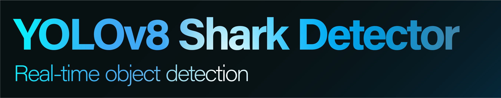
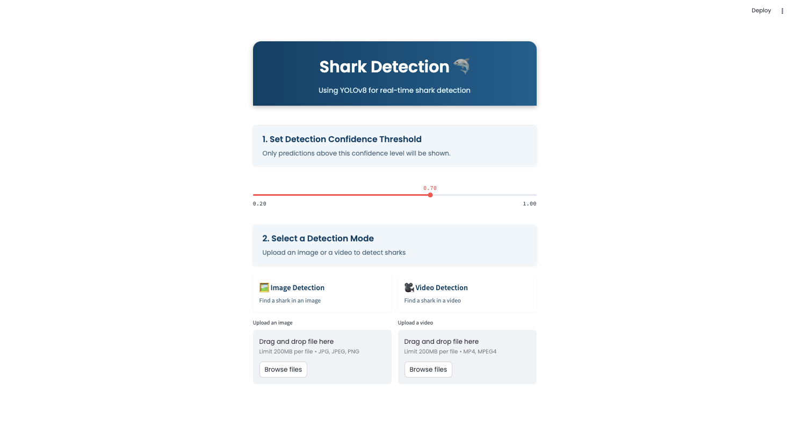
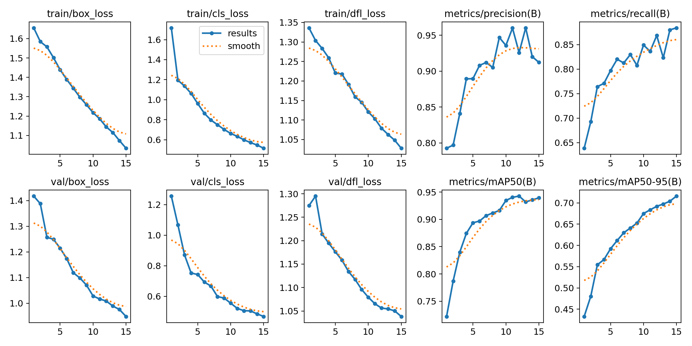
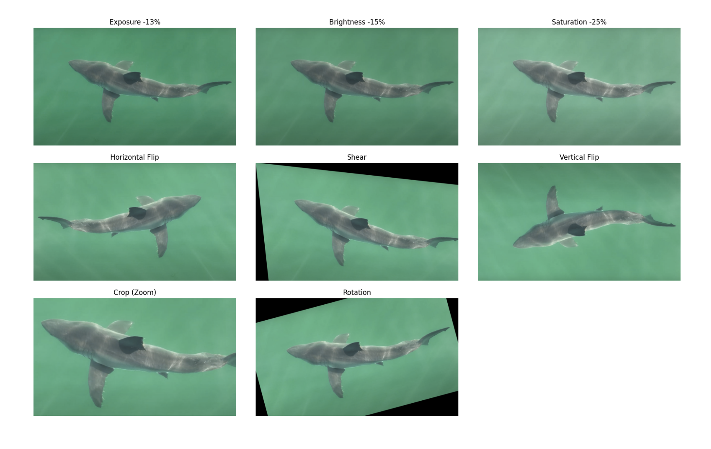
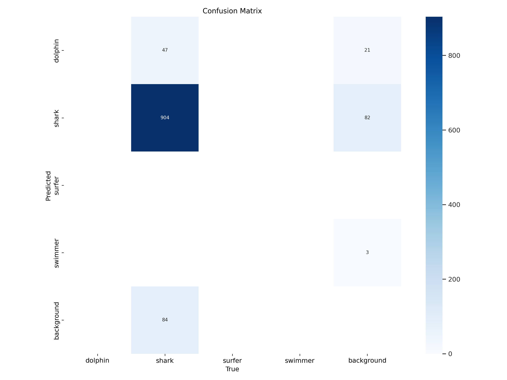
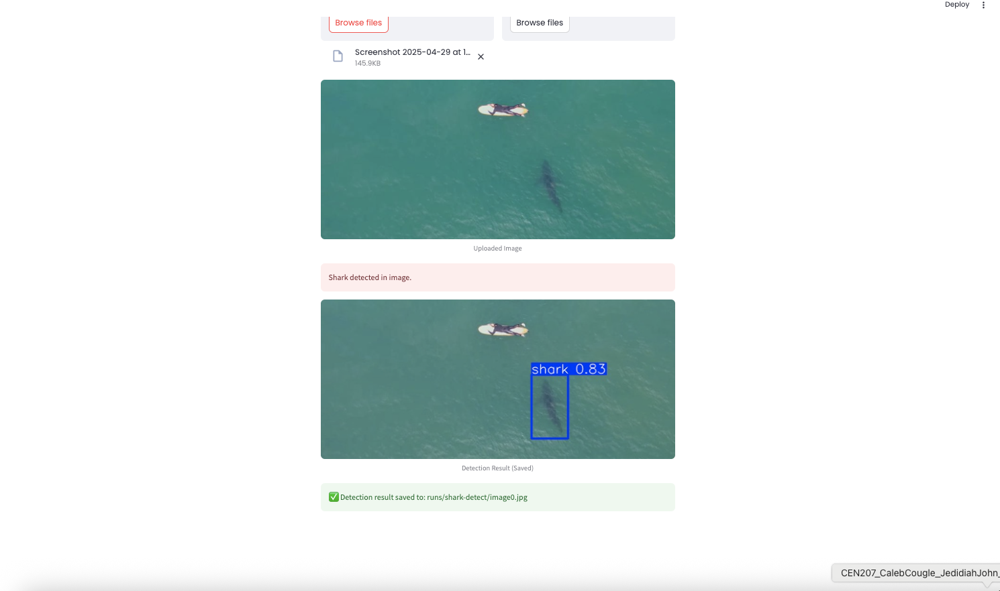

This app is a prototype showcasing a `YOLOv8s` model for real-time shark detection in aerial images and videos. It aims to demonstrate how AI object detection on drones presents an opportunity to enhance public safety in Australia, addressing concerns such as drowning risks in unpatrolled areas and reducing the need for harmful measures to prevent shark encounters. The system detects sharks—and can include other marine threats, such as distressed swimmers—alerting local surf lifesavers for quick responses. This tool complements existing safety measures, enhancing support while avoiding practices that harm local ecosystems.


*Shark Detector Application Interface.*

---

## Project Overview

* **Team Project:** Developed as a university capstone project at Torrens University.
* **Goal:** Built as a real-time marine threat detection tool deployable via drones, aiming to assist lifeguards avoid shark encounters.

## Key Features

* **Real-time Detection:** Analyzes live video streams for immediate threat identification.
* **Image Analysis:** Capable of processing individual photos.
* **Adjustable Confidence Threshold:** Allows users to control the sensitivity of detections.
* **Visual Bounding Boxes:** Displays detected sharks with clear bounding boxes and confidence scores.
* **Drone Deployable:** Designed with potential for integration into drone operations.


## Technologies Used

* **Python 3.9+:** The primary programming language.
* **Streamlit:** Used for building the interactive web demonstration application.
* **Ultralytics (YOLOv8s):** One pass real-time object detection.
* **OpenCV:** Utilised for image and video processing tasks.
* **Roboflow:** Employed for dataset management, labeling, and data augmentation.
* **Google Colab (A100 GPU):** Used for high-performance model training.


## Background
Developed as part of a university capstone project, this application demonstrates the use of AI and computer vision for public safety. `YOLOv8` was selected for its one-pass architecture, which processes entire images in real time, suitable for the  project requirements. It supports early shark detection from aerial drone footage with the goal of assisting lifeguards and emergency response teams.

## Training the Model
The notebook [Model_training_notebook.ipynb](Model_training/Model_training_notebook.ipynb) contains the full training pipeline used before integrating the model weights into the application. The model was trained using:

* YOLOv8s from Ultralytics
* Google Colab + A100 GPU
* Roboflow for dataset management and augmentation
* 60 epochs with batch size 64
* Input resolution upscaled to 960×960 for final models

During training, we monitored key metrics to ensure optimal performance:

*The training and validation loss curves show the model converging, while precision, recall, and mAP metrics improved steadily over 15 epochs, indicating effective learning and generalization.*

## The Dataset
We used a custom dataset combining open-source aerial footage and custom footage. Negative examples (e.g., images of surfers, dolphins, and empty ocean scenes) were included to help the model distinguish sharks from other marine objects and reduce false positives. The dataset size was **15,907 total images**.
Data was split into 70% training, 20% validation, 10% testing.

### Data Augmentation
Data augmentation techniques were implemented within the `Roboflow` platform to improve generalisation and reduce overfitting. Effective techniques for augmentation followed [*A Survey on Image Data Augmentation for Deep Learning*](https://journalofbigdata.springeropen.com/articles/10.1186/s40537-019-0197-0)
 



## Model Performance
To identify the best configuration of the parameters, all model training runs and their performance metrics were meticautomatically logged and compared. 

### Key Metrics (best run)
* `mAP@50: 96.4%`
* `Precision: 94.0%`
* `Recall: 91.6% `

### Confusion Matrix
On the validation set, the model correctly identified **928** shark images (true positives). It also misclassified **148** background images as sharks (false positives) and missed **107** sharks by labelling them as background (false negatives).


## Running the App
Open Command Prompt (CMD) or Terminal.

1.  **Navigate to the app’s folder.**
    Use the `cd` command. For example:
    ```bash
    cd "/path/to/your/app/folder"
    ```
    (Remember to replace `/path/to/your/app/folder` with your actual directory.)

2.  **Run the app using Streamlit.**
    Execute:
    ```bash
    python -m streamlit run shark.py
    ```
    Your default browser should automatically open the app. If not, copy the URL shown in CMD/Terminal.

3.  **Configure Confidence Level**
    Adjust the "Confidence Level" slider. Only predictions with a confidence score *above* this threshold will be displayed. Higher confidence means fewer, but generally more reliable, detections.

4.  **Upload Content for Detection**
    * **For Image Detection:** Drag and drop or browse to select a `.jpg`, `.jpeg`, or `.png` image. The app will then process and display detections.
    * **For Video Detection:** Drag and drop or browse to select a `.mp4` or `.mpeg4` video. The app will process and display detections in real-time as it plays.

5. **Voilà!**
The model will **detect** if there is a **shark** in the image or video and surround it with **a bounding box** displaying the confidence score.

    
    *A detected shark with its bounding box and confidence score.*

### Requirements
- Python 3.9+
- Streamlit
- Ultralytics
- OpenCV
- Roboflow
## Notes
- **Proof of Concept:** Not production ready  
- **Educational Demo:** Intended for learning, not operational use  
- **Data Source:** All training data was publicly sourced/openly licensed  
- **Data Augmentation:** Techniques followed [A Comprehensive Survey on Data Augmentation in Visual Recognition](https://journalofbigdata.springeropen.com/articles/10.1186/s40537-019-0197-0)  
- **YOLO Tutorials:** Based on [YOLO Development for Beginners v8/v9/v10: From the basic usage of YOLO to implementing applications with Python](https://www.amazon.com/dp/XXXXXXXXXX) by Joe A.  
