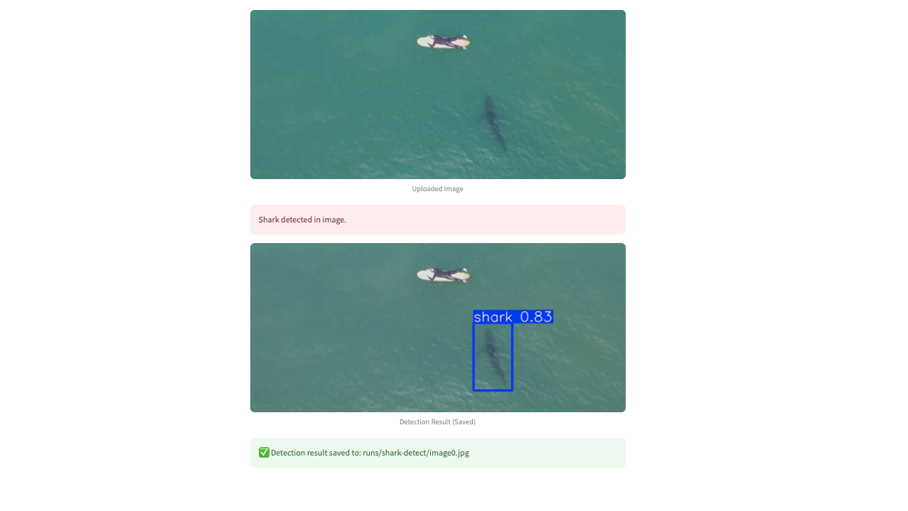

## YOLOv8 Shark Detector Application  

Developed as part of a `Torrens University` capstone project, this app leverages `Ultralytics` `YOLOv8` on aerial drone imagery to detect sharks and other marine hazards in real time. Built with Streamlit for rapid prototyping, it provides an early-warning tool to support lifeguards and enhance beach safety.

*Shark Detector Demonstration.*

*Shark Detector Application Interface.*

---
## Repository Structure

- **README.md**: Main overview  
- **shark.py**: Streamlit demo  
- **train_model.ipynb**: Training notebook  
- **TRAINING_GUIDE.md**: How-to guide  
- **LICENSE**: AGPL-3.0 license  

## Project Overview

Developed as a Torrens University capstone, this drone-deployable tool uses YOLOv8 on aerial imagery to detect sharks and other hazards in real time.

## Key Features

- **Real-time detection** on live video streams and single images  
- **Adjustable confidence** slider for sensitivity control  
- **Visual bounding boxes** with confidence scores 
- **Drone Deployable:** Designed with potential for integration into drone operations.

## Technologies

Python 3.9+, Streamlit, Ultralytics YOLOv8s, OpenCV, Roboflow, Google Colab (A100 GPU)

## Background
Developed as a Torrens University capstone, this tool harnesses YOLOv8’s one-pass detection on high-altitude drone footage to provide early shark warnings. By processing real-time video streams, it assists surf lifesavers in making rapid decisions while minimising ecological impact.

## Training the Model

- **Notebook:** [train_model.ipynb](Model_training/train_model.ipynb)  
- **Guide:** [TRAINING_GUIDE.md](Model_training/TRAINING_GUIDE.md)

Trained with YOLOv8s on Colab (A100), Roboflow-managed data, 60 epochs at 960×960.
During training, we monitored key metrics to ensure optimal performance:

*The training and validation loss curves show the model converging, while precision, recall, and mAP metrics improved steadily over 15 epochs, indicating effective learning and generalisation.*

## Dataset
Compiled from **15 907** aerial images combining open-source marine footage and custom drone captures. To reduce false alarms, negatives include surfers, dolphins, and empty-water scenes. Data was split into **70/20/10** for training/validation/testing.

### Data Augmentation
Applied flip, shear, and crop transformations via Roboflow to improve model. Techniques follow best practices outlined in [A Survey on Image Data Augmentation for Deep Learning](https://journalofbigdata.springeropen.com/articles/10.1186/s40537-019-0197-0).
 
 *Samples of the data augmentation techniques used*

## Performance

- **mAP@50:** 96.4%  
- **Precision:** 94.0%  
- **Recall:** 91.6%  
- **Confusion (val):** 928 TP | 148 FP | 107 FN  

## Running the App

1. `cd /path/to/repo`  
2. `streamlit run shark.py`  
3. Adjust the confidence slider  
4. Upload a .jpg/.png or .mp4 to detect sharks  

    
    *A detected shark with its bounding box and confidence score.*

### Requirements

streamlit>=1.20.0
ultralytics>=8.3.156
torch>=2.7.1
torchvision>=0.17.2
streamlit-webrtc>=0.45.0
av>=10.0.0
opencv-python-headless>=4.11.0.86
Pillow>=11.0.0
numpy>=1.23.0

## Resources & License

- **License:** AGPL-3.0 (see [LICENSE](./LICENSE))  
- **Docs & Guides:**  
  - [Streamlit](https://docs.streamlit.io/)  
  - [Roboflow](https://docs.roboflow.com/)  
  - [Ultralytics YOLOv8](https://docs.ultralytics.com/)  
- **Data Augmentation Techniques:**  
  [Image Data Augmentation for Deep Learning](https://journalofbigdata.springeropen.com/articles/10.1186/s40537-019-0197-0)  
- **Status:** Proof-of-concept; educational demo only, not production-ready  
