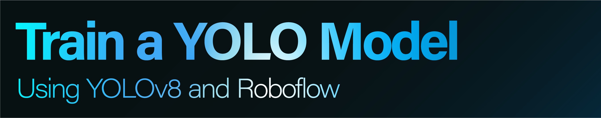

This document explains running the [Model Training Notebook](Model_training/train_model.ipynb) with YOLO and Robolow to train an object detection model with a custom dataset.

## Overview

- Installs dependencies
- Mounts Google Drive
- Downloads dataset from Roboflow
- Trains YOLOv8s model
- Logs metrics to CSV
- Backs up model to Drive
- Runs inference on uploaded image

## Requirements

- Google Colab environment (or Jupyter with internet access)
- Python 3.7+
- Roboflow API key with access to your project
- Google Drive account for storage
- [requirements-train.txt](Model_training/requirements-train.txt)

## Usage

1. **Open in Colab**  
   Click “Open in Colab” or upload the notebook to Colab.

2. **Configure your project**  
   In the dataset download cell, using your own Roboflow credentials replace:
   - `YOUR_API_KEY`  
   - `YOUR_WORKSPACE`  
   - `YOUR_PROJECT`

3. **Run cells in order**  
   - **Cell 1:** Install & import dependencies  
   - **Cell 2:** Mount Drive  
   - **Cell 3:** Download dataset  
   - **Cell 4:** Train model  
   - **Cell 5:** Log metrics  
   - **Cell 6:** Backup & inference

## Outputs

- **Model weights:** `runs/train/.../weights/best.pt`  
- **Metrics CSV:** `performance.csv` in your Drive  
- **Backup folder:** `MyDrive/yolo_models/{run_folder}`  
- **Inference results:** saved in `runs/detect/predict*`

## License

This notebook is part of the Safe Distance Shark Monitor project and is licensed under the AGPL-3.0. See [LICENSE](./LICENSE) for details.
